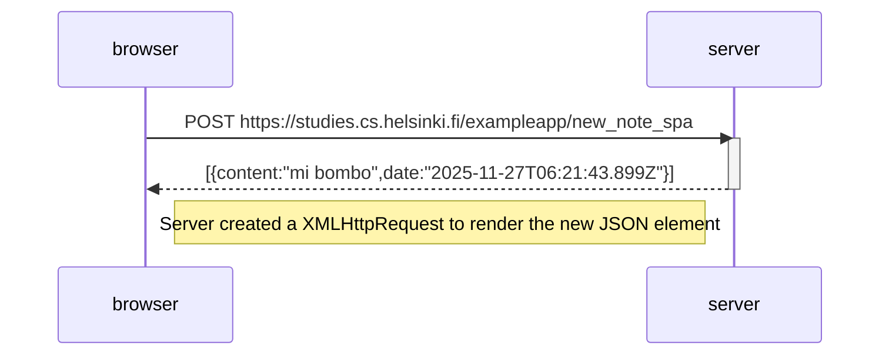

```mermaid
sequenceDiagram
    participant browser
    participant server

    browser->>server: POST https://studies.cs.helsinki.fi/exampleapp/new_note_spa
    activate server
    server-->>browser: [{content:"mi bombo",date:"2025-11-27T06:21:43.899Z"}]
    deactivate server

    Note right of browser: Server created a XMLHttpRequest to render the new JSON element
```